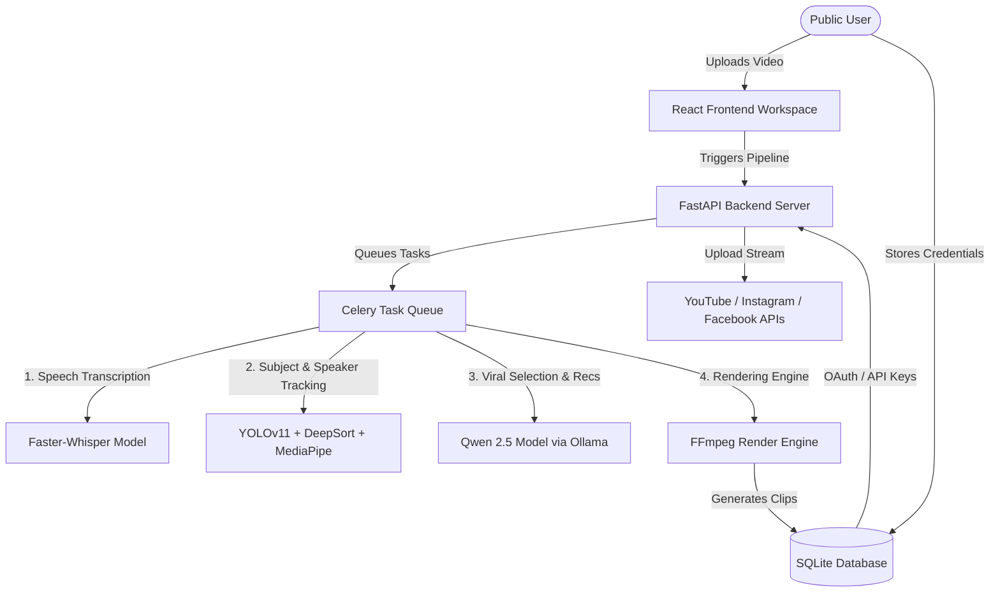
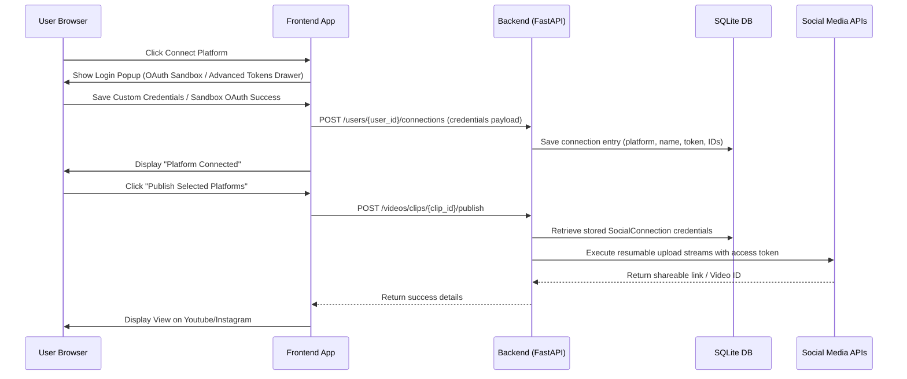

# Product Requirement Document (PRD)
## Project Name: Harvest AI (Automated Video Repurposing & Multi-User Social Publishing Platform)

---

## 1. Executive Summary & Vision

### 1.1 Goal
**Harvest AI** is a premium, automated AI-powered video workspace designed to ingest standard landscape widescreen videos (16:9) and repurpose them into highly engaging, optimized vertical formats (9:16) for short-form video platforms such as **YouTube Shorts, Instagram Reels, and Facebook Reels**. 

### 1.2 Core Value Proposition
* **Automated Curation**: Utilizes AI speech analysis and content understanding to identify the most viral, hook-heavy hooks and clip windows.
* **Active Speaker Focus**: Keeps the active talking subject perfectly centered in vertical viewports using object detection, tracking, and lip-movement variance tracking.
* **Multi-User Connection & Publishing**: Empowers public users to authenticate their own profiles dynamically, store credentials securely in a database (real storage), and publish content directly from the studio workspace.

---

## 2. System Architecture & Workflows

Below is the conceptual architecture showing how source video files are processed and published:

---

## 3. Detailed Model Workflows

### 3.1 Audio Transcription, Subtitle Translation & Timing Alignment
* **Whisper Transcription**: Extracts the audio stream into a temporary wave file and transcribes it using `faster-whisper-base` to output precise word-level start/end timestamps.
* **Multilingual Subtitle Translation**: Integrates `deep-translator` (Google Translate) for standard translations, and uses local/API-based Qwen models for colloquial Tamil and Latinized Tanglish optimizations (e.g., short, punchy, chat-style words like "வீடியோ", "work aagudhu" suitable for fast vertical reading).
* **Word Timing Distribution**: Re-groups the original word-level timestamps into sentence lines, translates the entire sentence, and distributes the word timing proportionally across the translated word list, avoiding translation drift.

### 3.2 Target Subject Tracking & Active Speaker Focusing
Rather than standard center-cropping, Harvest AI implements an advanced three-tier vision pipeline:
1. **YOLOv11 (`yolo11n.pt`)**: Detects person boundaries (`class: 0`) in every frame of the video.
2. **DeepSort**: Assigns persistent track IDs to characters to track movements across frame transitions.
3. **MediaPipe FaceMesh**: Tracks facial landmarks and calculates the **Mouth Aspect Ratio (MAR)**.
4. **Active Speaker Identification**: Computes the variance of the lip movements over time. The character tracking ID displaying the highest MAR variance is targeted as the active speaker, and the video's crop frame automatically pans to frame them.

### 3.3 LLM-Powered Highlight Selection & Gameplay Fallback
* **Viral Highlight Selection**: Qwen 2.5 (via Ollama or OpenRouter) analyzes the transcript to score segments based on hook strength, pacing, and completeness, outputting optimal 15–60 second clip cuts.
* **Gameplay Fallback**: If the transcription is empty or very short, the `audio_analyzer` service extracts wave amplitude peaks directly from the audio file to locate action-heavy zones (e.g. gameplay clips or loud sound effects).
* **Music Matching & Ducking**: Mixes a background audio track (Lofi, Cinematic, Upbeat, etc.) into the final clip. If speech is detected, it automatically ducks the background music volume.

### 3.4 Dynamic Voice Dubbing & Pacing Alignment
Harvest AI supports dynamic translation-dubbing workflows:
1. **Voice Synthesis**: Uses Google Cloud Text-to-Speech (Wavenet/Neural) or pitch-shifted local `gTTS` fallbacks to clone speech in the target language.
2. **Pitch Shifting**: Applies custom FFmpeg filter chains to modify audio pitch based on target speaker profiles (`male` uses `asetrate=22050*0.82,atempo=1.22`, `female` uses `asetrate=22050*1.12,atempo=0.89`).
3. **Pacing Match**: Speeds up or stretches synthesized segments using FFmpeg's `atempo` to precisely fit the original speech durations.
4. **Audio Mixing**: Compiles dub segments on a silent timeline and mixes with the video under three modes: `keep` (original audio only), `replace` (dubbed audio only), or `mix` (blend original at 0.3 ducked volume with dubbed voice).

---

## 4. Multi-User Database-Backed Publishing

### 4.1 "Real Storage" Credentials Table Structure (`social_connections`)
Credentials are saved in the database rather than client-side `localStorage`, securing multi-device consistency:

| Column Name | Data Type | Description |
| :--- | :--- | :--- |
| `id` | INTEGER | Primary Key (Auto-Increment) |
| `user_id` | INTEGER | Foreign Key to User table (`users.id`) |
| `platform` | VARCHAR | Platform indicator (`youtube`, `facebook`, `instagram`) |
| `account_name`| VARCHAR | User or Page Display Name |
| `account_handle`| VARCHAR | User or Page Handle |
| `account_avatar`| VARCHAR | User Profile Avatar URL |
| `credentials`| JSON | Dictionary containing tokens, page IDs, and URLs |
| `created_at` | DATETIME | Timestamp of connection creation |

### 4.2 Credentials Resolution Flow
When a user publishes a clip, the system resolves credentials in the following hierarchical order:
1. **Request Payload**: Checks if dynamic credentials are explicitly passed in the `platform_configs` request dictionary.
2. **Database Storage**: Falls back to query the project owner's saved credentials in the `social_connections` table.
3. **Environment Settings**: Falls back to the global developer application developer credentials defined in the site-owner's `.env` configuration file.
4. **Mock Simulator**: Executes a high-fidelity visual upload simulation for testing environments if no tokens are found.

### 4.3 Resumable Publishing APIs
1. **YouTube Shorts API**: Executes a resumable upload starting with metadata registration (title, description, status) and maps a custom content stream upload chunk to the resulting Google endpoint. Automatically restricts title properties to a maximum length of 100 characters.
2. **Facebook Reels (Graph API)**: Initializes a session via the Meta Graph API (`video_reels` endpoint), uploads raw binary chunks, and finishes the session to publish the reel with custom descriptions.
3. **Instagram Reels (Graph API)**: Creates a media container by referencing a public MP4 URL (`PUBLIC_VIDEO_URL`), polls Meta's servers for the `FINISHED` container render status (up to 15 attempts with 3s intervals), and triggers publishing.

---

## 5. Technology Stack Summary

* **Frontend**: React (Vite, Tailwind CSS, Framer Motion for premium 3D landing transitions and Obsidian Dark layouts).
* **Backend API**: FastAPI (Python 3.10+, SQLite database with SQLAlchemy).
* **Task Queue**: Celery (Redis as broker and result storage).
* **Vision Models**: YOLOv11 (Ultralytics), DeepSort, MediaPipe.
* **Audio & Voice Models**: Faster-Whisper, Google Cloud Text-to-Speech (Neural/Wavenet), gTTS.
* **Translation**: Google Translate (`deep-translator` API), Qwen 2.5 translation prompts.
* **LLM Integration**: Ollama (Qwen 2.5 local model) / OpenRouter API fallback.
* **Rendering Engine**: FFmpeg / MoviePy (handling subtitle draws, margins, overlays, pacing filters, and transition animations).
