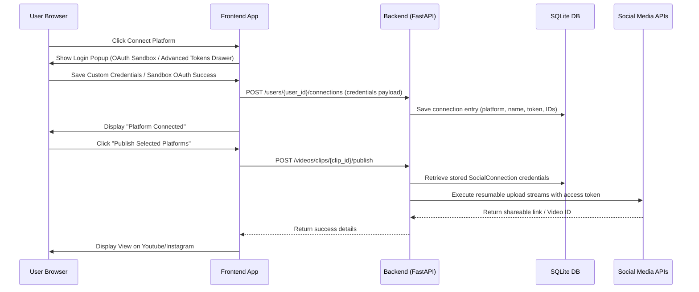

# Product Requirement Document (PRD)
## Project Name: Harvest AI (Automated Video Repurposing & Multi-User Social Publishing Platform)

---

## 1. Executive Summary & Vision

### 1.1 Goal
**Harvest AI** is a premium, automated AI-powered video workspace designed to ingest standard landscape widescreen videos (16:9) and repurpose them into highly engaging, optimized vertical formats (9:16) for short-form video platforms such as **YouTube Shorts, Instagram Reels, and Facebook Reels**. 

### 1.2 Core Value Proposition
* **Automated Curation**: Utilizes AI speech analysis and content understanding to identify the most viral, hook-heavy hooks and clip windows.
* **Active Speaker Focus**: Keeps the active talking subject perfectly centered in vertical viewports using object detection, tracking, and lip-movement variance tracking.
* **Multi-User Connection & Publishing**: Empowers public users to authenticate their own profiles dynamically, store credentials securely in a database (real storage), and publish content directly from the studio workspace.

---

## 2. System Architecture & Workflows

Below is the conceptual architecture showing how source video files are processed and published:

---

## 3. Detailed Model Workflows

### 3.1 Audio Transcription Pipeline (Faster-Whisper)
* **Purpose**: Transcribe speech from video files with word-level timestamps.
* **Mechanism**: Extracts the audio stream into a temporary wave file, processes it using `faster-whisper-base`, and outputs precise start/end timings for every spoken word.
* **Value**: Enables sync-accurate subtitle overlay and feeds text content to the LLM for highlight selection.

### 3.2 Target Subject Tracking & Active Speaker Focusing
Rather than standard center-cropping, Harvest AI implements an advanced three-tier vision pipeline:
1. **YOLOv11 (`yolo11n.pt`)**: Detects person boundaries (`class: 0`) in every frame of the video.
2. **DeepSort**: Assigns persistent track IDs to characters to track movements across frame transitions.
3. **MediaPipe FaceMesh**: Tracks facial landmarks and calculates the **Mouth Aspect Ratio (MAR)**.
4. **Active Speaker Identification**: Computes the variance of the lip movements over time. The character tracking ID displaying the highest MAR variance is targeted as the active speaker, and the video's crop frame automatically pans to frame them.

### 3.3 LLM-Powered Viral Clip Curation (Qwen 2.5 via Ollama)
* **Purpose**: Automate highlight curation and match audio-visual editing prompts.
* **Highlight Detection**: Analyzes the timestamped speech transcript to score segments based on hook strength, pacing, and completeness, returning logical 30–60 second clip cuts.
* **Editing Suggestions**: Interprets natural language prompts (e.g., *"Make it hype and gold"*) into subtitle sizing, colors, transition styles, and zoom frequencies.
* **Music Matching**: Matches the emotional tone of the video to background audio presets (Lofi, Cinematic, Upbeat, etc.) with custom volume mixing.

---

## 4. Multi-User Database-Backed Publishing

### 4.1 "Real Storage" Credentials Table Structure (`social_connections`)
Credentials are saved in the database rather than client-side `localStorage`, securing multi-device consistency:

| Column Name | Data Type | Description |
| :--- | :--- | :--- |
| `id` | INTEGER | Primary Key (Auto-Increment) |
| `user_id` | INTEGER | Foreign Key to User table (`users.id`) |
| `platform` | VARCHAR | Platform indicator (`youtube`, `facebook`, `instagram`) |
| `account_name`| VARCHAR | User or Page Display Name |
| `account_handle`| VARCHAR | User or Page Handle |
| `account_avatar`| VARCHAR | User Profile Avatar URL |
| `credentials`| JSON | Dictionary containing tokens, page IDs, and URLs |
| `created_at` | DATETIME | Timestamp of connection creation |

### 4.2 Credentials Resolution Flow
When a user publishes a clip, the system resolves credentials in the following hierarchical order:
1. **Request Payload**: Checks if dynamic credentials are explicitly passed in the `platform_configs` request dictionary.
2. **Database Storage**: Falls back to query the project owner's saved credentials in the `social_connections` table.
3. **Environment Settings**: Falls back to the global developer application developer credentials defined in the site-owner's `.env` configuration file.
4. **Mock Simulator**: Executes a high-fidelity visual upload simulation for testing environments if no tokens are found.

---

## 5. Technology Stack Summary

* **Frontend**: React (Vite, Tailwind CSS, Framer Motion for premium 3D landing transitions and Obsidion Dark layouts).
* **Backend API**: FastAPI (Python 3.10+, SQLite database with SQLAlchemy).
* **Task Queue**: Celery (Redis as broker and result storage).
* **Vision Models**: YOLOv11 (Ultralytics), DeepSort, MediaPipe.
* **Audio Models**: Faster-Whisper.
* **LLM Integration**: Ollama (Qwen 2.5 local model) / OpenRouter API fallback.
* **Rendering Engine**: FFmpeg / MoviePy (handling subtitle draws, margins, overlays, and transition animations).
